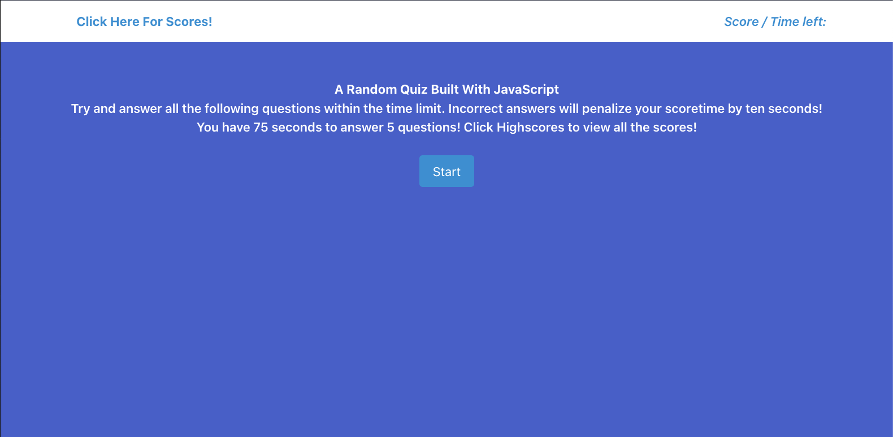

# A-Random-Quiz
​A random quiz built with javascript

## Table of contents
- [Overview](#overview)
  - [The challenge](#the-challenge)
  - [User Story](#user-story)
  - [Acceptance Criteria](#acceptance-criteria)
  - [Screenshot](#screenshot)
  - [Links](#links)
- [My process](#my-process)
  - [Built with](#built-with)
  - [Continued development](#continued-development)
  - [Useful resources](#useful-resources)
- [Author](#author)
​
**Note: Delete this note and update the table of contents based on what sections you keep.**
​
## Overview
### The challenge
​
Build a timed coding quiz with multiple-choice questions. This app will run in the browser and will feature dynamically updated HTML and CSS powered by JavaScript code that you write. It will have a clean, polished, and responsive user interface.
​
### User Story
​
```
AS A coding boot camp student
I WANT to take a timed quiz on JavaScript fundamentals that stores high scores
SO THAT I can gauge my progress compared to my peers
```

### Acceptance Criteria
```
GIVEN I am taking a code quiz
WHEN I click the start button
THEN a timer starts and I am presented with a question
WHEN I answer a question
THEN I am presented with another question
WHEN I answer a question incorrectly
THEN time is subtracted from the clock
WHEN all questions are answered or the timer reaches 0
THEN the game is over
WHEN the game is over
THEN I can save my initials and my score
```
​
### Screenshot
​

​
​
### Links
​
- Solution URL: [Github](https://github.com/VendettiStudios/A-Random-Quiz/edit/master/README.md)
- Live Site URL: [Live Link](https://vendettistudios.github.io/A-Random-Quiz/)
​
## My process
​
### Built with
​
- HTML
- BULMA (CSS)
- JAVASCRIPT
​
### Continued development
​
Improvements to Styling.
​
​
### Useful resources
​
- [Resource 1](https://developer.mozilla.org/en-US/docs/Web/JavaScript) - This documentation was incredibly helpful for learning JS syntax, and for constant reference.
- [Bulma](https://www.example.com) - Bulma is a really easy to use CSS framework
​
​
## Author
​
- Daniel - Daniel@VendettiStudios.com
​